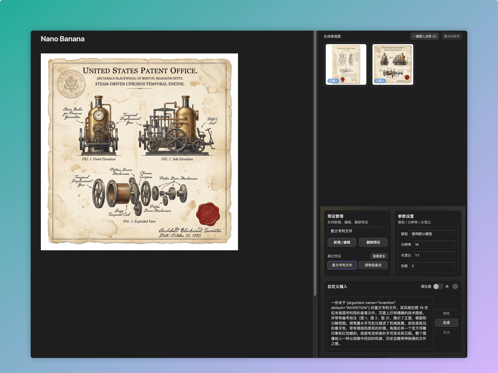
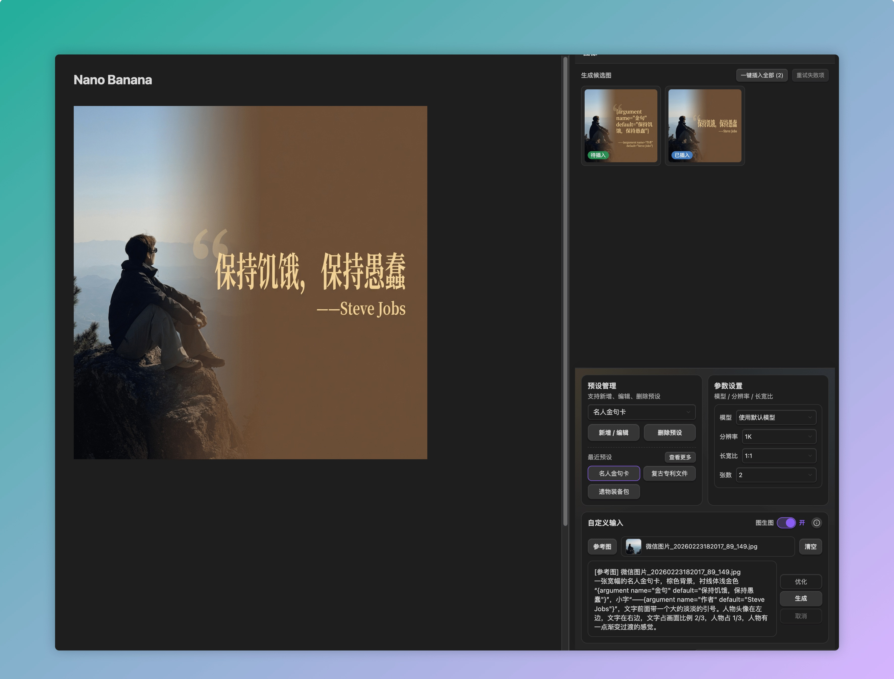
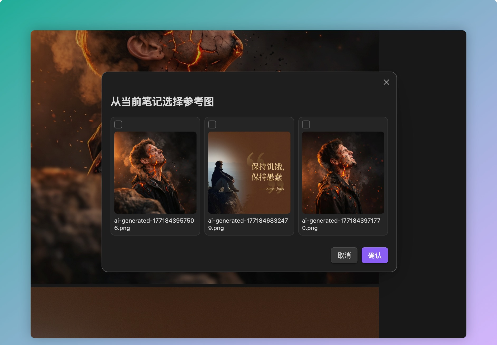
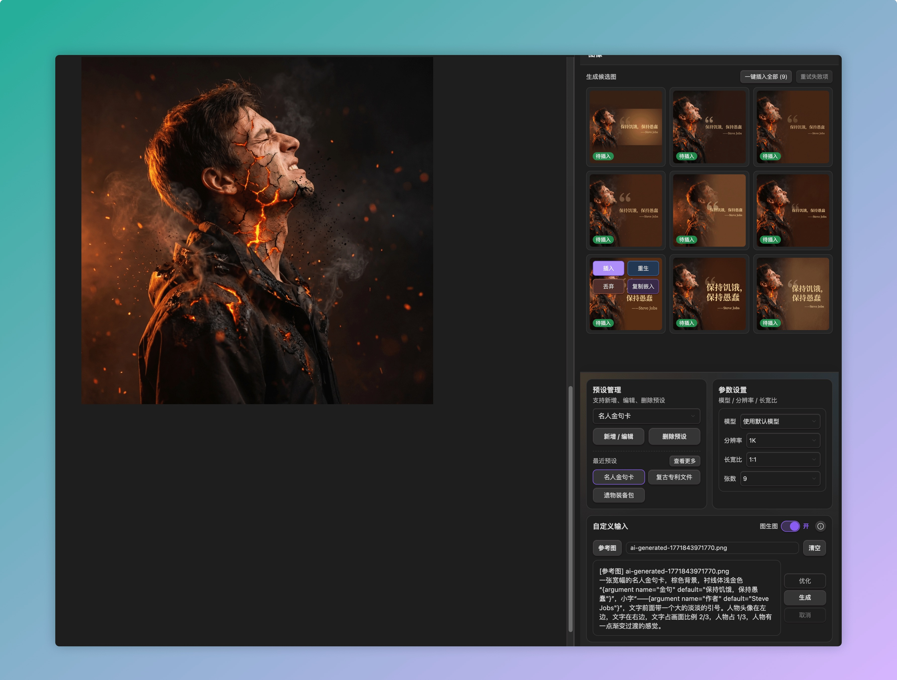
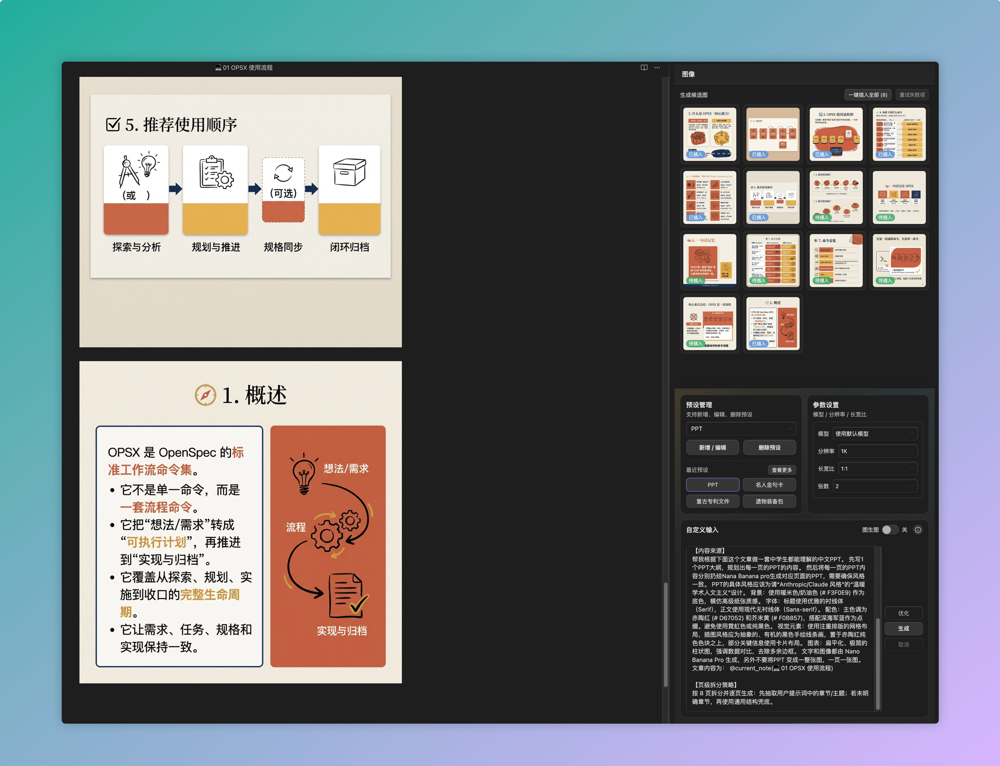

# Banana Studio (Obsidian Plugin)

[简体中文](#简体中文) | [English](#english)

---

## 简体中文

Banana Studio 是一个面向 Obsidian 的侧边栏 AI 生图插件，核心目标是：

1. 在侧边栏生成候选图
2. 选择单张图片
3. 手动插入到当前笔记正文

### 截图







### 当前能力（基于代码现状）

- 侧边栏工作流
  - 生成候选图
  - 单张插入（插入到当前 Markdown 笔记）
  - 一键插入全部
  - 单张重生 / 丢弃 / 复制嵌入语法
- 图生图（Image-to-Image）
  - 从本地上传参考图
  - 从当前笔记中选择已有图片作为参考图
  - 参考图名称自动同步到提示词首行（用于强引用）
- 提示词能力
  - `优化` 按钮支持优化提示词
  - 支持 `@current_note` 引用当前笔记内容
  - 支持 PPT 自动拆页模式（每页可生成多候选）
- 稳定性与性能
  - 自适应并发：最多 9 路；弱网自动降并发
  - 自适应重试 + 退避（超时/网络异常可重试）
  - 取消生成支持中断请求（AbortSignal）
  - 候选图区可视区虚拟渲染（大量候选图更流畅）
  - 过期候选图自动清理（TTL）
- Provider
  - OpenRouter
  - OpenAI
  - Gemini
  - ZenMux
  - Gemini Image: `Nano Banana 2 (Gemini 3.1 Flash Image)`
- 其他
  - 图片保存位置可配置（Vault 内相对路径）
  - 中英文界面（跟随 Obsidian 语言）

### 安装

#### 方式一：Release 安装（推荐）

1. 打开项目 Releases 页面下载最新版本。
2. 解压到你的 Vault：
   `.obsidian/plugins/banana-studio/`
3. 重启 Obsidian，在 `设置 -> 第三方插件` 启用 `Banana Studio`。

#### 方式二：本地开发安装

```bash
npm install
npm run build
bash scripts/deploy-dev.sh /你的/Vault/路径
```

### 快速开始

1. 打开任意 Markdown 笔记
2. 点击左侧香蕉图标打开侧边栏
3. 输入提示词（可用 `@current_note`）
4. 设置模型、分辨率、比例、张数
5. 点击 `生成`
6. 在候选图上点击 `插入`，将该图插入当前笔记正文

### 图生图推荐流程

1. 打开 `图生图` 开关
2. 点击 `参考图`，选择：
   - 从本地上传
   - 从当前笔记选择
3. 检查提示词首行是否存在 `[参考图] 文件名`
4. 点击 `生成`

### 常见问题

#### 1) 为什么“生成”按钮是灰色不可用？

常见原因：

- 没有填写提示词
- 处于图生图模式但没有有效参考图
- 当前正在生成（需先完成或取消）
- 未配置当前 Provider 的 API Key

#### 2) 选 9 张会不会 9 张同时生成？

- 正常网络下会尽量按 9 路并发
- 弱网会自动降并发（例如 3/2/1），优先稳定性
- 结果返回时间不同是正常现象

#### 3) 复制路径后应该粘贴什么？

- 插件复制的是 Obsidian 嵌入语法：`![[path/to/image.png]]`
- 直接粘贴到笔记正文即可显示图片

### 开发说明

```bash
npm install
npm run build
npm run lint
```

项目结构（核心）：

- `main.ts`: 插件入口
- `src/notes/sidebar-copilot-view.ts`: 侧边栏 UI 与交互逻辑
- `src/notes/notes-selection-handler.ts`: 笔记内容与插入逻辑
- `src/notes/note-image-task-manager.ts`: 生图任务生命周期管理
- `src/api/api-manager.ts`: Provider 统一路由
- `src/api/providers/*`: 各 Provider 实现
- `src/settings/*`: 插件设置与设置页

### 免责声明

- 本插件依赖第三方模型 API，调用可能产生费用
- API Key 存储在本地 Obsidian 配置中
- 生成内容合规责任由使用者自行承担

### License

MIT，见 [LICENSE](LICENSE)

---

## English

Banana Studio is a sidebar-first AI image plugin for Obsidian. The core flow is:

1. Generate candidate images in the sidebar
2. Pick one candidate
3. Manually insert it into the current note body

### Screenshots


### Current capabilities

- Sidebar workflow
  - Candidate generation
  - Single insert into current Markdown note
  - Insert all
  - Per-image regenerate / discard / copy embed syntax
- Image-to-Image
  - Upload local reference image
  - Select reference images from current note
  - Auto-sync reference filename to prompt first line
- Prompt features
  - Prompt optimization (`Optimize`)
  - `@current_note` context injection
  - PPT auto-split generation (multi-page, multi-variant)
- Stability and performance
  - Adaptive concurrency (up to 9, auto-downshift on weak networks)
  - Adaptive retry + backoff for retryable failures
  - True cancel via abort signal
  - Virtualized candidate list rendering for large batches
  - TTL cleanup for expired candidates
- Providers
  - OpenRouter
  - OpenAI
  - Gemini
  - ZenMux
  - Gemini Image: `Nano Banana 2 (Gemini 3.1 Flash Image)`
- Misc
  - Configurable image save folder (vault-relative)
  - Bilingual UI (follows Obsidian locale)

### Installation

#### Option A: Release package (recommended)

1. Download the latest package from Releases.
2. Extract to:
   `.obsidian/plugins/banana-studio/`
3. Restart Obsidian and enable `Banana Studio` in Community Plugins.

#### Option B: Local dev install

```bash
npm install
npm run build
bash scripts/deploy-dev.sh /path/to/your/vault
```

### Quick start

1. Open any Markdown note
2. Click the banana ribbon icon to open sidebar
3. Enter prompt (`@current_note` supported)
4. Set model/resolution/aspect/count
5. Click `Generate`
6. Click `Insert` on a candidate card to insert into note body

### FAQ

#### Why is the Generate button disabled?

Typical reasons:

- Prompt is empty
- Image-to-image is enabled but no valid reference image
- Generation is currently running
- API key for selected provider is missing

#### If I choose 9 images, are they generated in parallel?

- Usually yes, up to 9-way in normal networks
- On weak networks, concurrency is auto-reduced for stability
- Different completion times are expected

### Development

```bash
npm install
npm run build
npm run lint
```

Core files:

- `main.ts`
- `src/notes/sidebar-copilot-view.ts`
- `src/notes/notes-selection-handler.ts`
- `src/notes/note-image-task-manager.ts`
- `src/api/api-manager.ts`
- `src/api/providers/*`
- `src/settings/*`

### Disclaimer

- Third-party model APIs may incur costs
- API keys are stored locally in Obsidian config
- Content compliance is the user's responsibility

### License

MIT, see [LICENSE](LICENSE)
